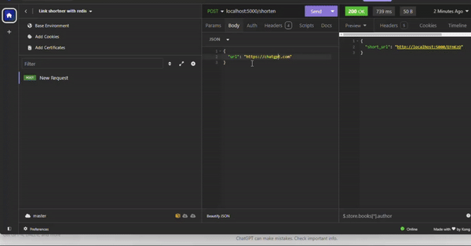

# link-shortner-tg-bot

Out of boredom and a lack of motivation to proceed with my ongoing project, SmartLearn, I decided to create a Telegram bot that runs a Flask app to shorten URL links. I mostly view the Telegram platform as a place to build bots that automate certain tasks for me.

To build this, I needed a database to store the long URLs (values) and lookups for the URLs (keys). I also wanted the database to have fast retrieval and low latency for a better user experience. Although, in my wildest expectations, this would be used as an API, so only developers would use it, Redis Cache fits well for this application.

Don’t know about Redis??, check [Here !](https://redis.io)

# How to replicate

> 1. Ensure you have python installed on your macnhine (>3.8) with the latest version of pip. Also, for this project, i used a Redis cache, to store lookups (keys) for the long urls. You could use a free server from upstash or ...(do your findings)

> 2. create a virtual environment, if you want to (do this!1)
`python -m venv .env`

> 3. Activate the virtual environment with this command
(windows) `source .env/Scripts/activate`
(Linux) `source .env/bin/activate`

> 4. Install the requirements
`pip install requirements.txt` 

> 5. next is to copy .env.examples and edit it with your values. I used a redis cache, for fast retrival of the url.

# Testing 

